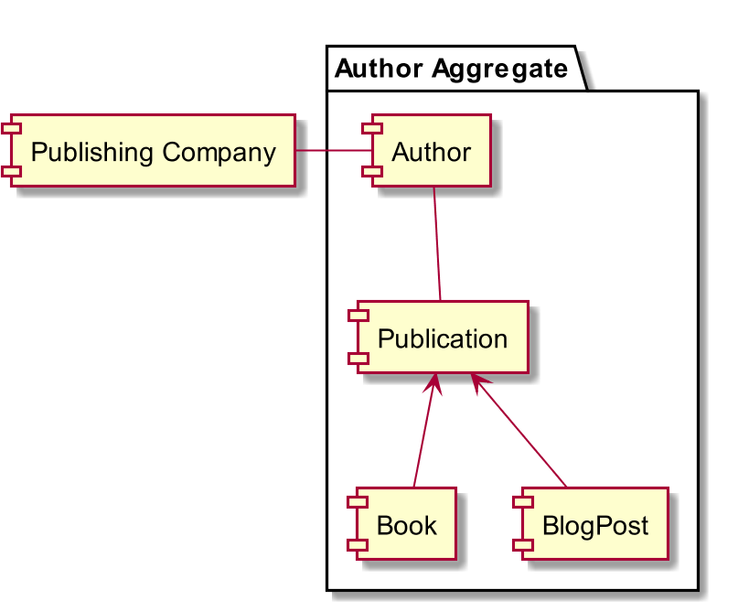
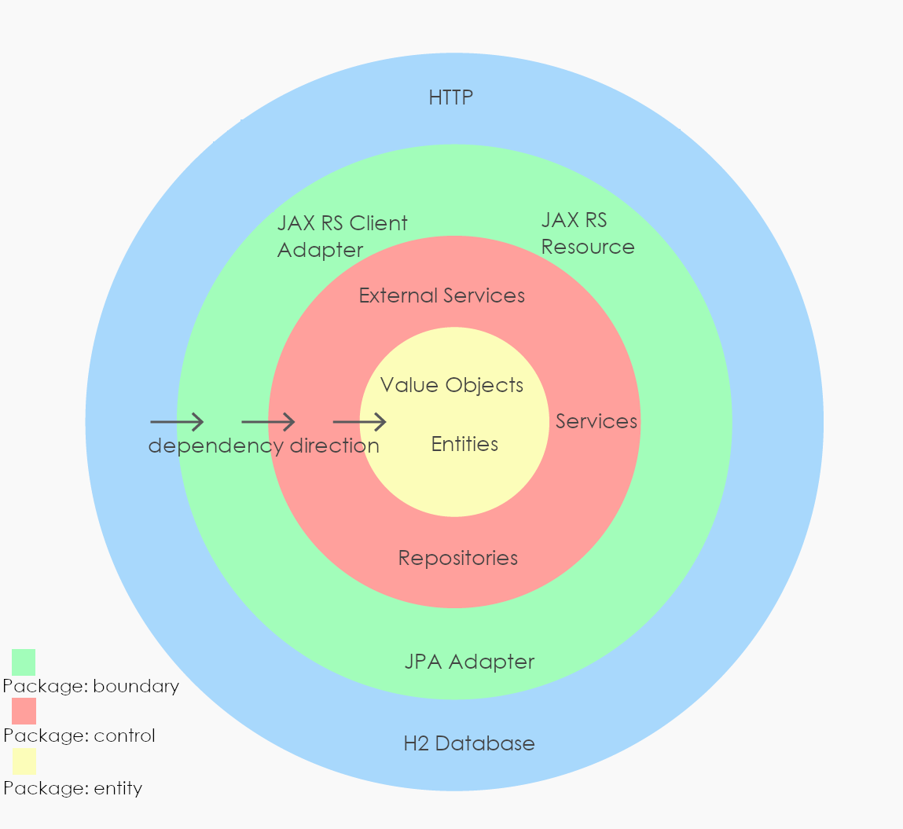

= publishingcompany-app

Diese Java Applikation stellt einen Architekturshowcase dar, fuer eine Applikation welche mit Ideen aus DDD und Clean Architecture, auf Basis des Quarkus, umgesetzt ist.

== Domain

Die fachliche Grundlage stellt eine Buchhandlung "publishing company" dar. In der Buchhandlung werden zu Autoren verschieden Publizierungen (Buecher oder Blog-Posts) verwaltet.

Die folgende Skizze stellt eine Uebersicht ueber die Domain dar:

== Aufbau

Der Showcase vereint Ideen aus den beiden Standardwerken "Domain Driven Design" und "Clean Architecture".

Bei der Package-Struktur wird auf das BCE-Konzept (Boundary-Control-Entity) gesetzt um eine einfache und standardisierte Struktur zu ermoeglichen.

Alle 3 genannten Konzepte ergaenzen sich hervorragend, fuer die Kombination von Clean Architecture (im Artikel als Hexagonal angefuehrt, die Grundidee ist allerdings die gleiche) und BCE bietet folgender Link einen guten Einstieg: http://www.cs.sjsu.edu/~pearce/modules/patterns/enterprise/ecb/ecb.htm .

Schematisch dargestellt, ist die Applikation wie folgt aufgebaut:

