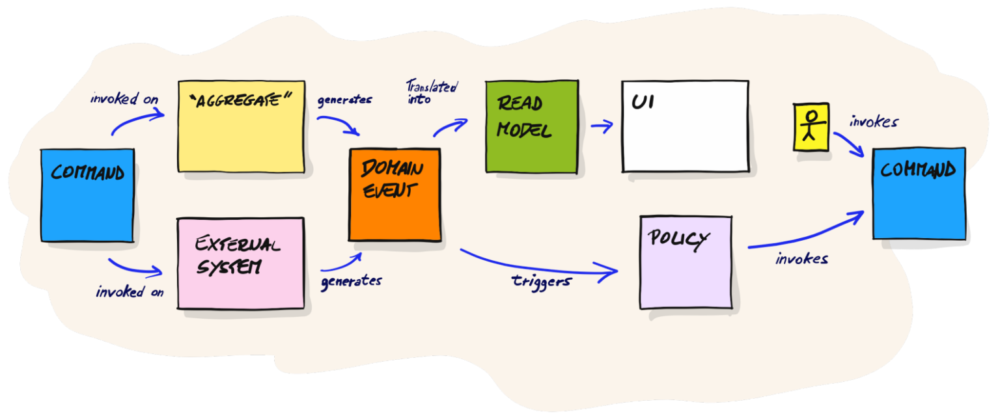
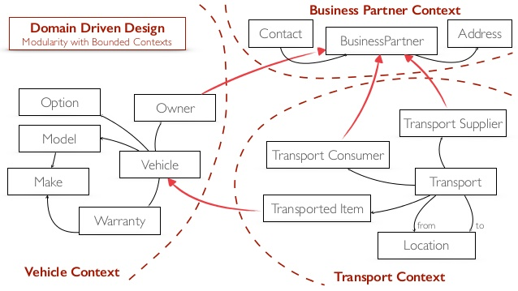
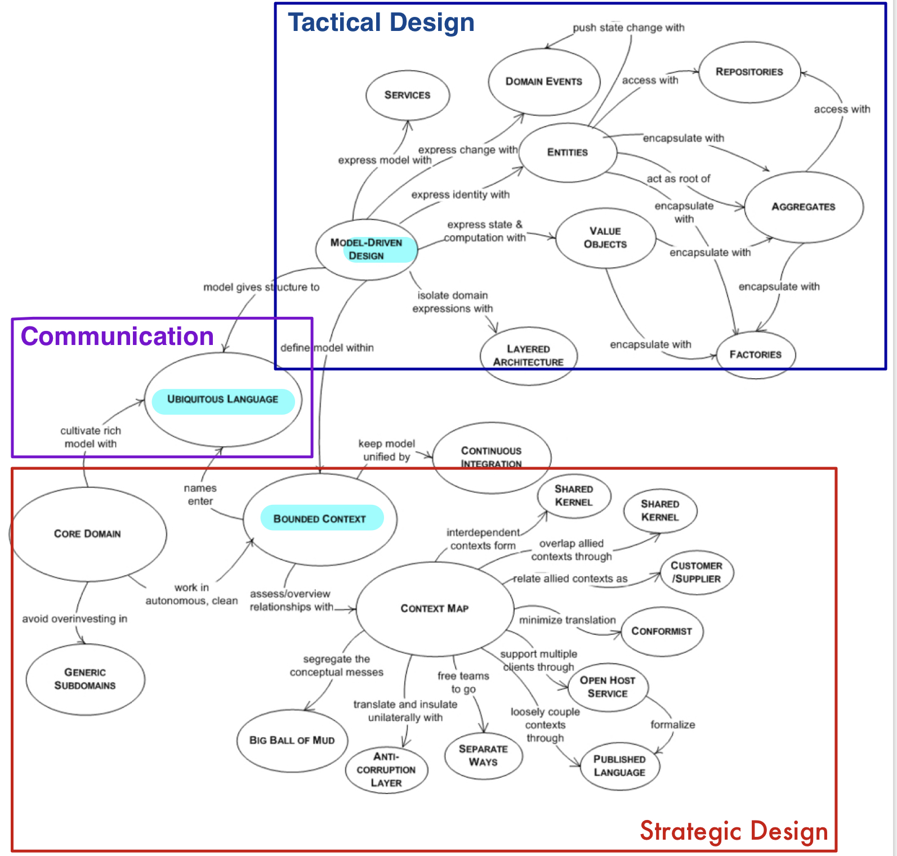
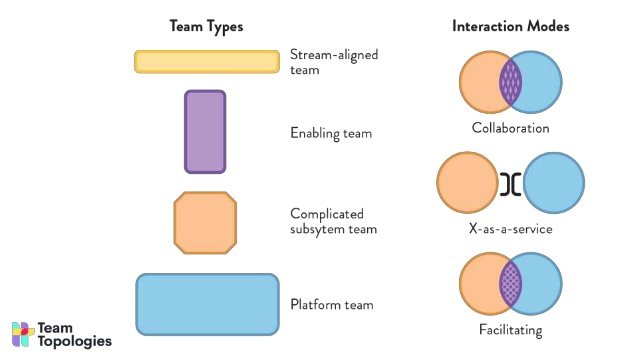
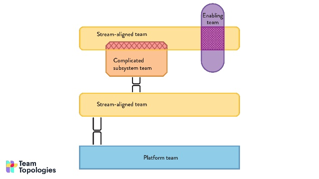
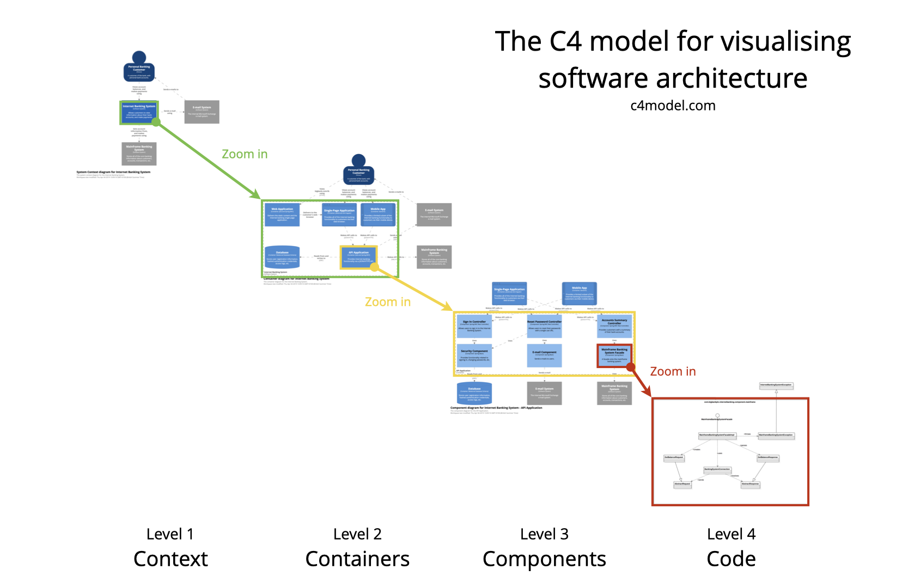
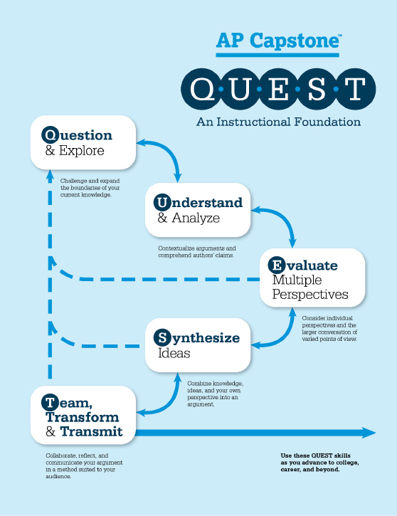
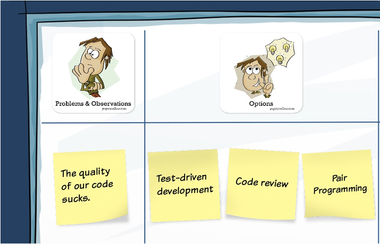
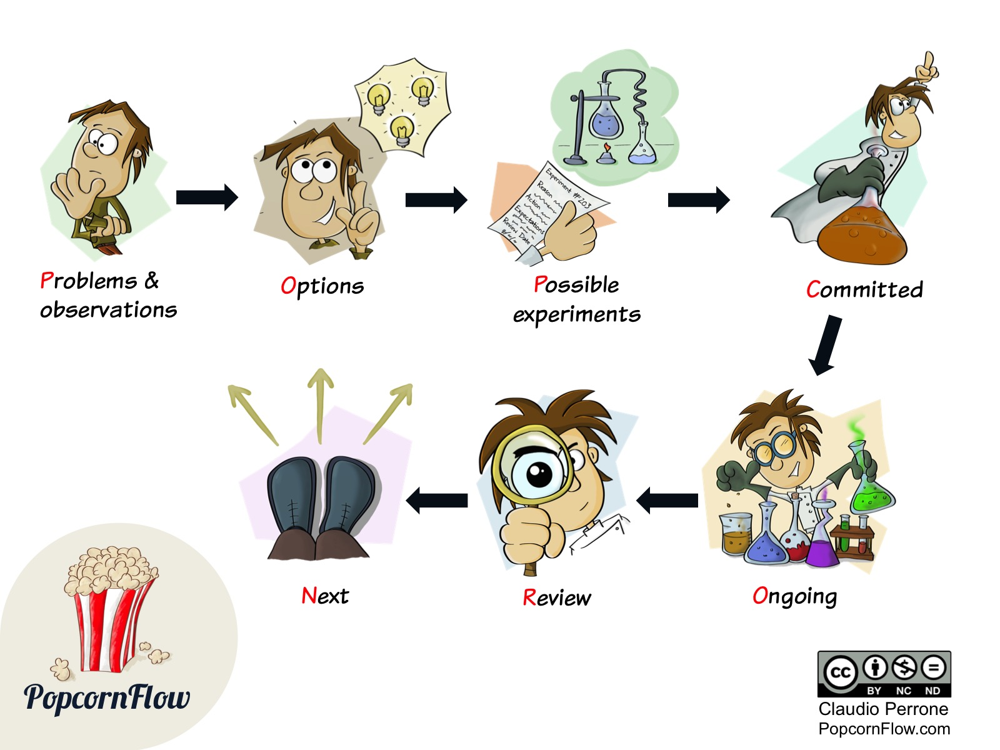
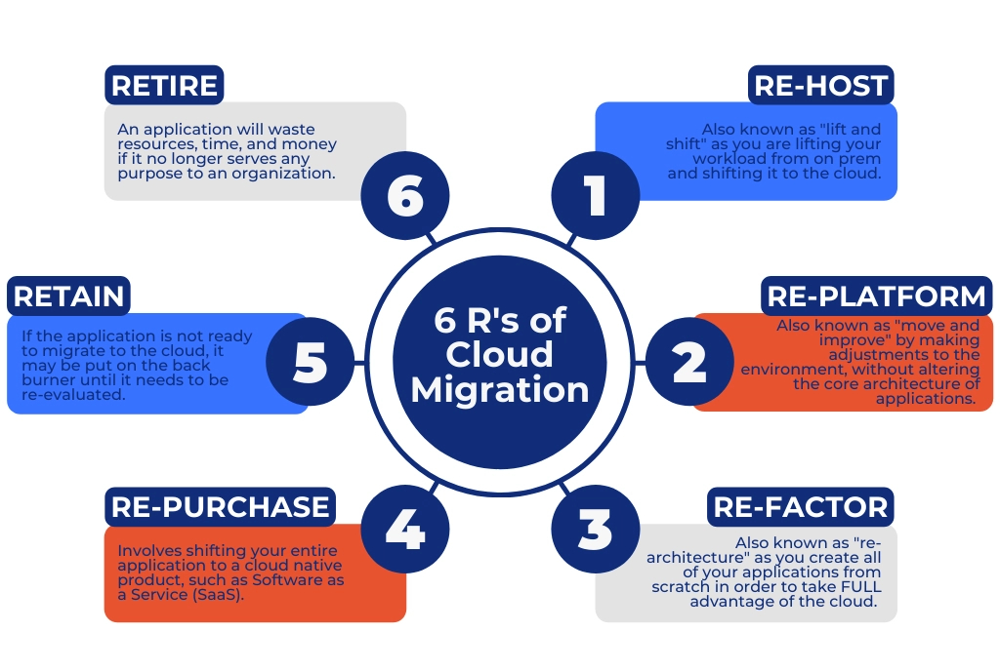

Leitfaden zur Erstellung und Weiterentwicklung von Software Architekturen
=========================================================================
Konrad Renner
v1.1.0, {localdate}: Überarbeitete Version
:lang: de
:description: Leitfaden für den Einsatz von Prozessen und Tools zur Konzeptionierung und Weiterentwicklung von Software Architekturen
:toclevels: 1
:title-page:
:title-logo-image: image:images/title_logo.png[top=25%,align=right,pdfwidth=2.5in]

Dieses Dokument kann als Leitfaden für den Einsatz von Prozessen und Tools zur Konzeptionierung und Weiterentwicklung von Software Architekturen verwendet werden.

<<<<
== Präambel

Dokumentation ist kein Selbstzweck. Wirkungsvolle Architekturdokumentation unterstützt bei der Arbeit im Team und gegenüber Dritten, ohne zu lähmen. Gut gemachte Dokumentation hilft, wichtige Ziele innerhalb des Softwarevorhabens effizient zu erreichen.

Es geht dabei nicht darum, im Vorfeld alles auszudefinieren, vielmehr sollen Entscheidungen zu dem Zeitpunkt festgehalten werden, an dem sie getroffen wurden. Daraus ergibt sich in weiterer Folge eine Dokumentation wichtiger Entscheidungen inklusive deren Ursprung und somit wird die daraus resultierende Software Architektur nachvollziehbar. Diese Dokumentation hilft also den Aufbau eines Software Systems zu verstehen und zu kommunizieren.

In vielen Unternehmen werden Lastspitzen mithilfe von externen Entwicklern abgefedert, Systeme externen Überprüfungen unterzogen oder das Unternehmen ist einer erhöhten Fluktation und im schlimmsten Fall dem "Verlust" einer Wissensinsel ausgesetzt. Ohne Entscheidungen transparent und nachvollziehbar zu dokumentieren, kann man diesen Herausforderungen nicht gerecht werden.

<<<<
== TL;DR

* Mithilfe von <<ddd, Domain Driven Design>> wird ein fachliches Modell erstellt
** Dieses soll sich im Code widerspiegeln
** Mit den Mitteln des <<taktisch, taktischen Design>> wird innerhalb des <<bounded, Bounded Context>> modelliert
** Mit den Mitteln des <<strategisch, strategischen Design>> werden die <<bounded, Bounded Context>>s definiert und deren Kommunikationsstränge untereinander auf einer <<map, Context Map>> visualisiert
** <<event, Event Storming>> ist ein effizienter Workshop-Stil zur fachlichen Modellierung auf Basis von DDD
* Der Einsatz der Konzepte von <<team, Team Topologies>> unterstützt bei der Optimierung der Teaminteraktionen über den gesamten Entwicklungs- und Deliveryprozess hinweg
** Mithilfe des <<popcorn, PopcornFlow>> lassen sich die Konzepte schrittweise und evolutionär einführen, sowie kontinuierlich an das eigene Umfeld anpassen
* Das <<c4,C4-Modell>> beschreibt einen Ansatz, ein Software System iterativ immer detaillierter zu definieren und zu beschreiben
* Das <<arc42, arc42-Template>> ist der defacto Standard zur Konzeptionierung und Dokumentation von Software Systemen im deutschen Sprachraum
** Das Befüllen des Templates sollte iterativ erfolgen (kein Wasserfall-Vorgehen bei der Architekturentwicklung!), bspw. mithilfe des <<quest,Q.U.E.S.T. Konzept>>
** Dateiformat und Ablageort sollten sich an die <<docs,Docs-as-Code>> Prinzipien halten
** Ein arc42-Template welches mit Hinweisen befüllt wurde, wie die unterschiedlichste Kapitel auf Basis dieses Leitfadens befüllt werden können ist unter diesem link:https://github.com/konradrenner/stammdaten/blob/master/publishingcompany-service/published-docs/arc42.pdf[Link] zu finden
* Um Differenzen zwischen Ist- und Soll-Architektur zeitnah zu erkennen, sollten <<refactor,Architekturretrospektiven>> regelmäßig durchgeführt werden
* Auf Code-Ebene kann die Einhaltung von Vorgaben automatisiert mithilfe von link:https://www.archunit.org/[ArchUnit] umgesetzt werden
* Entscheidungen sollen im Format von link:https://github.com/joelparkerhenderson/architecture-decision-record/blob/main/templates/decision-record-template-by-michael-nygard/index.md[Architectural Decision Records] dokumentiert werden
* Ein <<board,Architekturboard>> kann als die zentrale Anlaufstelle für Entscheidungen die mehrere Teams betreffen fungieren
** Zusätzlich dient es zur Abstimmung zwischen den Architekten der Teams

<<<<
=== Beispiel

Die Entwickler des <<stream,Stream-aligned Team>> X sollen ihre Applikation um eine komplexe Anforderung erweitern. Da eine solche Anforderung von diesen Entwicklern noch nie umgesetzt wurde, fragen sie beim <<enabling,Enabling Team>> um Unterstützung an.

Im folgenden organisieren sie mit Fachexperten, Product Ownern, usw. einen <<event, Event Storming>> Workshop und entwickeln daraus <<ddd,fachliche Modelle>> auf deren Basis, zum einen die Umsetzung durchgeführt wird und zum anderen fachliche Fragen, für alle Beteilitgen verständlich, besprochen werden.

Erste Entscheidungen wurden somit bereits getroffen und Randbedingungen für die weitere Arbeitsweise können definiert werden. Alle diese Informationen werden mithilfe des <<arc42, arc42-Template>> festgehalten und bspw. in einem Versionsverwaltungssystem als AsciiDoc-File abgelegt.

Während der <<archentw,Architekturentwicklung>> wird erkannt, dass eine neue technologische Komponente diverse Probleme lösen könnte. Daher wird beim <<platform,Platform Team>>, welches zuständig für "Fancy Komponenten" ist, die Bereitstellung der Komponente angefragt bzw. hinterfragt ob diese in der momentanen Systemarchitektur überhaupt einsetzbar ist.

Da diese Komponente auch für andere Teams hilfreich sein könnten, wird diese im nächsten <<board,Architekturboard>> vorgestellt und darüber diskutiert ob die Freigabe der Komponente auch für andere Teams sinnvoll ist.

Inzwischen hat die Umsetzung der Anforderung gestartet. Während dieser ist Entwickler Y zur Erkenntnis gekommen, dass das aktuelle fachliche Modell an gewissen Stellen nicht zielführend ist. Daher wird ein neuer Workshop initiiert, im Zuge dessen die Erkenntnisse diskutiert und das Modell überarbeitet wird.

=> An dieser Stelle sollte das iterative Vorgehen bereits klar ersichtlich sein. Dieses Beispiel stellt nur einen möglichen Verlauf dar. Im Endeffekt liegt es in der Hand jedes Teams seinen eignen "idealen" bzw. passenden Prozess zu finden. Dieses Dokument beschreibt im Endeffekt nur Prozesse und Tools die am Markt erprobt sind und somit das Rad nicht zwangsweise neu erfunden werden muss.

<<<<
[#archentw]
== Architekturentwicklung

Egal ob auf "grüner Wiese" oder bei der Änderung eines Bestandsystems, der entscheidende Punkt ist, die fachlichen Zusammenhänge zu erkennen. Davon abgeleitet können Entscheidungen auf allen Ebenen getroffen werden die nachhaltig sinnvoll sind.

<<ddd, Domain Driven Design (DDD)>> formalisiert bzw. standardisiert viele Modellierungsmöglichkeiten um fachliche Zusammenhänge zu beschreiben und verständlich darstellen zu können. DDD gibt dabei im Unterschied zu bspw. UML keine exakten Vorgaben wie ein Modell visualisiert wird. Vielmehr steht im Fokus, eine gemeinsame allgegenwärtige Sprache (<<language>>) zwischen den beteiligten Personen zu entwickeln und darauf aufbauend ein fachliches Modell zu erstellen.

Das Erstellen eines fachlichen Modells, dass für alle Beteiligten klar verständlich ist, ist dabei eine nicht zu unterschätzende komplexe Aufgabe. Im Umfeld von DDD hat sich <<event, Event Storming>> als effektive Form zur Entwicklung eines fachlichen Modells etabliert.

Zu beachten ist, dass sich dieses Modell im weiteren Vorlauf mit ziemlicher Sicherheit ändern wird. Im weiteren Verlauf sollten fachliche Diskussionen also immer auf Basis des Modells durchgeführt werden und so das Modell laufend verbessert werden. Idealerweise bildet der Source Code des Software Systems das Modell ab und so können die Auswirkungen der Änderungen relativ einfach von allen Beteiligten abgeschätzt werden. Damit wird auch die Auswirkung einer Änderung für alle Beteiligten sofort sichtbar und begleitende Maßnahmen können eingeleitet werden.

Es handelt sich dabei also um ein iteratives Vorgehen und passt somit perfekt zu agilen Vorgehensmodellen. Von einem Vorgehen wie bspw. im klassischen Wasserfallmodell beschrieben, wird also abgeraten!

Architekten und Entwickler sind nicht zwangsläufig verschiedene Rollen und/oder Menschen. Die Architektur entsteht im Team und wird gemeinsam umgesetzt. Die Umsetzung von funktionierender Software ist also ein kollaborativer Prozess zwischen Menschen mit unterschiedlichen Fähigkeiten. <<team, Team Topologies>> formalisiert diesen Team Gedanken und stellt ein Rahmenwerk für die organisatorisch effiziente Umsetzung und Bereitstellung eines Software Systems zur Verfügung. Änderungen am Zusammenarbeitsmodell sollten <<popcorn,behutsam und evolutionär>> eingeführt werden, sodass diese von allen Beteiligten akzeptiert und mitgetragen werden.

Alle nachfolgenden Punkte, erfolgen also nicht chronologisch nach der "Entwicklung einer Architektur" sondern parallel dazu. Die Architektur wird somit laufend verfeinert und immer detaillierter beschrieben. Wichtig ist dabei immer an folgendes zu denken: Die Wahrheit liegt zwar im Code, _warum_ der Code so vorliegt wie er vorliegt kann jedoch nicht aus diesem entnommen werden. Um das nachzuvollziehen dient die Architekturdokumentation (oder anders formuliert: die Dokumentation der Entscheidungen, welche zur Architektur geführt haben).

Für die "Erkundung" eines Software Systems stellt das <<c4,C4-Modell>> eine "Anleitung" dar, wie immer weiter in ein System "gezoomed" wird und man somit Schritt für Schritt das System designed bzw. erkundet.

<<<<
== Konzeptionierung und Dokumentation

Die Konzeptionierung und Dokumentation verfolgt im wesentlichen grob 3 Ziele:

Architekturabeit unterstützen:: Damit ist das Erarbeiten von Architektur gemeint. Dazu zählt nicht nur der Architekturentwurf, sondern auch die <<quest,iterative Weiterentwicklung>>.

Umsetzung/Weiterentwicklung leiten:: Das Ziel des Vorhabens ist funktionierende Software. Daher dient gute Architekturdokumentation insbesondere der Kommunikation der Lösung in Richtung Umsetzung.

Architektur nachvollziehbar und bewertbar machen:: Nachvollziehbarkeit ist untrennbar mit guter Architektur verbunden. Zum einen geht es bei der Nachvollziehbarkeit darum, die Lösung zu verstehen. Zum anderen
aber auch darum, sie bewerten zu können (ist die Architektur für die aktuelle Aufgabenstellung passend?).

Der defacto Standard im deutschen Sprachraum zur Konzeptionierung und Dokumentation von Software Systemen ist das <<arc42, arc42-Template>>. Dieses Template stellt ein Rahmenwerk zur Verfügung, um ein Architektur strukturiert und nachvollziehbar dokumentieren zu können.

<<<<

Wichtig an der Stelle ist zu betonen, dass das arc42-Template nicht sofort vollständig befüllt werden muss. Auch an dieser Stelle wird zu einem iterativen Vorgehen geraten. Es werden also immer nur die im Moment notwendigen Kapitel befüllt bzw. ausdefiniert. Folgende Tabelle bietet einen Überblick über die Kapitel des Templates und welche Ziele diese vorrangig adressieren (das bedeutet natürlich nicht, dass ein Kapitel für ein Ziel überhaupt nicht zuträglich ist):

[%header,cols="<,^,^,^,*"]
|===
|Kapitel
|Architekturarbeit unterstützen
|Umsetzung/Weiterentwicklung leiten
|Architektur nachvollziehbar und bewertbar machen

|Systemkontext
|X
|
|

|Qualitätsziele
|X
|
|

|Technische Risiken
|X
|
|

|Architekturentscheidungen
|X
|
|X

|Bausteinsicht
|X
|X
|

|Übergreifende Konzepte
|
|X
|

|Verteilungssicht
|
|X
|

|Randbedingungen
|X
|
|X

|Qualitätszenarien
|
|
|X
|===

Die Dokumentation wird dabei unter den gleichen Voraussetzungen wie der Source Code behandelt und somit auch über das im Einsatz befindliche Versionsverwaltungssystem verwaltet. Dieses Vorgehen wird als <<docs,Docs-as-Code>> bezeichnet und ermöglicht ein kollaboratives, qualitätsicherndes und nachvollziehbares Vorgehen bei der Erstellung und Weiterentwicklung der Dokumentation.

<<<<
[#refactor]
== Weiterentwicklung und Refactoring

Dokumentation haftet der Beigeschmack an, veraltet zu sein, sobald sie erstellt wurde. Gestalten man die Architekturdokumentation allerdings nicht als Dokumentation eines zu erreichend Zustandes, sondern als Sammlung von Entscheidungen, so erhält man ein Dokument, welches ein Software System verstehen lässt.

Natürlich können auch Entscheidungen obsolet werden, deshalb ist es wichtig, diese laufend zu überarbeiten bzw. auf Aktualität zu überprüfen. Daher ist es sinnvoll zumindest einmal pro Monat (oder jeden 2. Sprint, falls mit Sprints gearbeitet wird) Architekturretrospektiven einzuplanen.

Ziel dieser Retrospektive ist es, zu folgenden Punkten, Differenzen zwischen Soll- und Ist-Architektur zu finden und in weiterer Folge einen Task für den nächsten Zyklus aufzunehmen um die Differenzen auszugleichen:

* Differenzen innerhalb eines <<bounded, Bounded Context>>
* Differenzen in der <<map, Context Map>>
* Differenzen im genutzten Tooling oder Plattformen
* Kontrolle von Qualitätsmetriken (bspw. via link:https://www.sonarqube.org/[sonarqube])
* Dokumentation warum es zu den Differenzen gekommen ist
* Dokumentation von bewusst eingegangen Differenzen

Es empfiehlt sich die Moderation dieser Retrospektiven durch einen Kollegen durchführen zu lassen, welcher sich nicht im unmittelbaren Team befindet, um problematische Situationen unvoreingenommen klären zu können.

Auf Code-Ebene kann die Einhaltung von Vorgaben automatisiert mithilfe von link:https://www.archunit.org/[ArchUnit] bereits zum Build-Zeitpunkt überprüft werden. Wie bei klassischen Unit-Tests entschädigen die langfristigen Vorteile, den initialen Mehraufwand zur Umsetzung der Tests.

<<<<
[#nachvollziehbar]
== Nachvollziehbarkeit von Entscheidungen

Eine der Kernerwartungen an einen Architekten ist es, Architekturentscheidungen zu treffen. Architekturentscheidungen betreffen normalerweise die Struktur der Anwendung oder des Systems, sie können jedoch auch Technologieentscheidungen beinhalten, insbesondere wenn diese Technologieentscheidungen Auswirkungen auf Architekturmerkmale haben. Unabhängig vom Kontext hilft eine gute Architekturentscheidung den Entwicklungsteams dabei, die richtigen technischen Entscheidungen zu treffen. Um Architekturentscheidungen zu treffen, müssen genügend relevante Informationen gesammelt, die Entscheidung begründet, die Entscheidung nachvollziehbar dokumentiert und diese Entscheidung effektiv an die richtigen Stakeholder kommuniziert werden.

Eine effiziente und effektive Möglichkeiten Architekturentscheidungen nachvollziehbar zu dokumentieren, ist der Einsatz von link:https://adr.github.io/[Architectural Decision Records]. Entscheidungen welche mehrere Teams betreffen könnten, sollten über ein <<board,Architekturboard>> diskutiert,  dokumentiert und kommuniziert werden.

Die klare Empfehlung ist, auf dieses Format auch innerhalb des eigenen Teams zu setzen (also auch Entscheidungen mit lokalen Auswirkungen - innerhalb des Teams - entsprechend zu dokumentieren).

<<<<
[#board]
== Architekturboard

Ein Architekturboard dient der Vernetzung bzw. dem Informationsaustausch der Architekten der <<stream,Stream-aligned Teams>>, zum einen untereinander und zum anderen mit Kollegen aus den anderen <<teamtypen,Team-Typen>>. Zu diesem Zweck treffen sich die Mitglieder des Boards in regelmäßigen Abständen - entweder persönlich oder per Videokonferenz - und besprechen aktuelle Themen.

Entscheidungen die im Architekturboard getroffen werden und damit in der Regel Auswirkungen auf mehrere Teams haben, werden als Architekturentscheidungen, wie im Kapitel <<nachvollziehbar,Nachvollziehbarkeit von Entscheidungen>> beschrieben, dokumentiert.

<<<<
== Appendix

[#ddd]
=== Domain Driven Design

Softwareentwicklung scheitert häufig nicht an der Technik, sondern an interdisziplinärer Kommunikation. Da Entwickler und Fachexperten mit unterschiedlichen Terminologien arbeiten, gibt es Verständnisprobleme.

Diese Verständnisprobleme versucht link:https://de.wikipedia.org/wiki/Domain-driven_Design[Domain Driven Design] (DDD) zu lösen, indem die Modellierung der Software maßgeblich von den umzusetzenden Fachlichkeiten der Anwendungsdomäne gesteuert wird.

Entscheidend dabei ist, dass zwischen Entwickler und Fachexperten iterativ eine <<language, gemeinsame Sprache>> entwickelt wird.

DDD ist an keinen bestimmten Softwareentwicklungsprozess gebunden, orientiert sich aber an agiler Softwareentwicklung. Insbesondere setzt es iterative Softwareentwicklung und eine enge Zusammenarbeit zwischen Entwicklern und Fachexperten voraus.

.Starter Process from https://github.com/ddd-crew/ddd-starter-modelling-process
image::./images/ddd-starter-modelling-process-colored.png[]

[#language]
==== Ubiquitous Language

DDD basiert auf einer Reihe von Konzepten, welche bei der Modellierung – aber auch anderen Tätigkeiten der Softwareentwicklung – berücksichtigt werden sollten. Das Hauptaugenmerk hierbei fällt auf die Einführung einer gemeinsamen/allgegenwärtigen Sprache (Ubiquitous Language), welche in allen Bereichen der Softwareerstellung verwendet werden sollte. Also eine Sprache für die Beschreibung der Fachlichkeit, der Elemente des Domänenmodells, der Klassen und Methoden usw.

<<<<
[#event]
==== Event Storming

link:http://ziobrando.blogspot.com/2013/11/introducing-event-storming.html[Event Storming] ist eine Workshop-basierte Methode, um herauszufinden, was in einem Softwareprogramms geschieht bzw. geschehen soll.
Dabei werden die Ereignisse (domain events) innerhalb des Software Systems mithilfe von Klebezetteln auf eine Wand gepinnt und in eine chronologische Reihenfolge gebracht. In weiterer Folge werden noch weitere Details (bspw. Prozesse) definiert und ebenfalls an die Wand gepinnt.

Am Ende eines Workshops sollten alle Beteiltigen das gleiche Verständnis über die Fachdomäne haben und fachliche Modell(e) können daraus relativ einfach abgeleitet werden.

<<<<
[#strategisch]
==== Strategisches Design

link:https://thedomaindrivendesign.io/what-is-strategic-design/[Strategisches Design] wird auch als strategische Modellierung bezeichnet und ist eine Säule des DDD, dessen Hauptziel es ist, die Bounded Contexts, die Ubiquitous Language und die Context Map zusammen mit dem gesamten Projektteam, den Domänenexperten und dem technischen Team, zu definieren.

[#bounded]
===== Bounded Context

Der Bounded Context beschreibt einen fachlichen Bereich, innerhalb dessen die gleiche fachliche Sprache gesprochen wird.

In der Microservice-Architektur dient ein Bounded Context oftmals als Basis für ein Microservice.

[#map]
===== Context Map

Die Context Map dient einer gesamthaften Übersicht über alle Modelle, deren Grenzen und Schnittstellen. Dadurch wachsen die Bounded Contexts nicht in Bereiche anderer Contexts, und die Kommunikation zwischen den Contexts läuft über wohldefinierte Schnittstellen.

.Beispiel einer Context Map und deren Bounded Contexts

<<<<
[#taktisch]
==== Taktisches Design

Das link:https://thedomaindrivendesign.io/what-is-tactical-design/[taktische Design] beschäftigt sich mit dem Aufbau des Domänenmodells innerhalb eines Bounded Contexts.

Dazu gibt DDD einige Konzepte vor, um ein sprechendes Domänenmodell erstellen zu können.

Idealerweise werden diese Konzepte in Kombination mit einer link:https://blog.cleancoder.com/uncle-bob/2012/08/13/the-clean-architecture.html[Clean Architecutre] umgesetzt und damit eine klare Trennung zwischen notwendiger technischer Integration und fachlichen Code geschaffen.

==== DDD Überblick

<<<<
[#team]
=== Team Topologies

link:https://teamtopologies.com/[Team Topologies] ist ein klarer, leicht verständlicher Ansatz für die moderne Software-Entwicklung und Bereitstellung mit einem Schwerpunkt auf der Optimierung der Teaminteraktionen über den gesamten Entwicklungs- und Deliveryprozess hinweg.

.Übersicht über Team Typen und Interaction Modes

<<<<
[#teamtypen]
==== Team Typen

[#stream]
===== Stream-aligned Team

Steam-aligned Teams besitzen den gesamten Teil einer Anwendungsdomäne (vom UI bis zur Datenbank). Dieser Team Typ ist ein "You Built It, You Run It"-Team. Es gibt keine Übergaben an andere Teams für irgendeinen Zweck.

Alle anderen Team Typen helfen dem Stream-aligned Teams ihre Arbeit effizient und zeitnah umzusetzen.

[#enabling]
===== Enabling Team

Enabling Teams sind teams welche in der Regel aus Experten eines speziellen Bereichs bestehen. Sie unterstützen Stream-aligned Teams dabei die Fähigkeiten zu erhalten, welche für die Erledigung ihrer Aufgaben notwendig sind.

===== Complicated subsytem Team

Complicated subsytem Teams sind dafür verantwortlich, Teile des Systems aufzubauen, die sehr spezifische Fähigkeiten erfordern. Ziel ist es, die kognitive Belastung der Mitglieder eines Stream-aligned Teams zu verringern

[#platform]
===== Platform Team

Plattform Teams sind verantwortlich für den Aufbau und Betrieb von Plattformen/Systemen die die Softwarebereitstellung für Stream-aligned Team beschleunigt und vereinfacht.

<<<<
==== Interaction Modes

.Beispiele von Team Interaction Modes

===== Collaboration

Direkte Zusammenarbeit für einen bestimmten Zeitraum.

===== X-as-a-service

Ein Team stellt etwas zur Verfügung und das andere Team konsumiert/nutzt es ("as a Service").

===== Facilitating

Ein Team hilft und betreut ein anderes Team.

<<<<
=== arc42

Das Open Source-Projekt link:https://arc42.de/[arc42] beeinhaltet ein pragmatisches und seit Jahren praxiserprobtes Template. Mittlerweile gilt es als Defacto-Standard im deutschen Sprachraum zur Architekturentwicklung und Dokumenation.

Im Kern besteht arc42 aus einem pragmatischen Template zur Entwicklung, Dokumentation und Kommunikation von Architekturen. arc42 ist komplett frei verwendbar (Open Source) und unterstützt Entwicklungsteams und Architekten. Es stammt aus der Praxis und basiert auf Erfahrungen internationaler Architekturprojekte und Rückmeldungen vieler Anwender.

arc42 eignet sich für beliebige Technologien und Werkzeuge. Neben dem Template schlägt arc42 sechs Kernaufgaben zur Entwicklung und Konstruktion effektiver Architekturen vor:

. Anforderungen und Randbedingungen klären
. Strukturen entwerfen
. Querschnittliche Konzepte entwerfen
. Architektur kommunizieren
. Umsetzung begleiten
. Architektur bewerten

<<<<
[#c4]
=== C4-Modell

Das link:https://c4model.com/[C4-Modell] wurde entwickelt, um Softwareentwicklungsteams bei der Beschreibung und Kommunikation der Architektur zu unterstützen.

Dabei werden "Karten" der Architektur bzw. des Codes auf verschiedenen Detailebenen erstellt, genauso als ob man mit Google Maps einen Bereich vergrößert oder verkleinert, um Informationen zu sehen, an denen man im Moment interessiert ist.

.Überblick über die 4 Detailebenen

<<<<
[#docs]
=== Docs-as-Code

Documentation as Code ist, wenn Entwickler Dokumentation mit den gleichen Methoden und Werkzeugen bearbeiten wie den Quellcode ihrer Programme.

Bei Documentation as Code sind Dokumente Teil von Code-Reviews, und der Continuous-Integration-Server erzeugt nicht nur lauffähige Software, sondern auch die dazu passenden Dokumente als druckfertige PDF- oder Online-Dokumentation.

Nutzt man nun auch noch Dokumentationsformate, die nicht auf binären Strukturen basieren, kann es von einer Versionsverwaltung in Git profitieren. Dann umfassen Code-Reviews und Releases nicht nur Änderungen am Programmcode, sondern auch die an der Dokumentation. Einfache Textdateien als Dokumentation sind allerdings keine Lösung, wenn Teams eine hochwertige und gut strukturierte Dokumentation erstellen sollen. An dieser Stelle kommt link:https://asciidoctor.org/[AsciiDoc] ins Spiel. Dieses Format ist in seinem Quellformat in einem Texteditor direkt les- und bearbeitbar, in Kombination mit link:https://plantuml.com/[plantuml] können auch Diagramme und Modelle in dieser Form erstellt werden. Über Konverter lasst sich das Format in hochwertige HTML- und PDF-Ausgaben umwandeln, die Auszeichnungen für Überschriften, Querverweise und Inhaltsverzeichnisse bieten.

Via Plugins für diverse gängige Build-Tools ist damit auch eine automatisierte Publizierung der Dokumente in unterschiedlichste Wiki-Systeme (z.B. confluence) möglich.

<<<<
[#quest]
=== Q.U.E.S.T. Konzept

Das Q.U.E.S.T. Konzept ist ein Vorgehensmodell um mit einem strukturierten Ablauf Arbeitsschritte oder Wissensaufbau effizienter und effektiver zu gestalten.

.Überblick über die 6 R der Cloud-Migrations-Strategien

<<<<
[#popcorn]
=== PopcornFlow

Der sogenannte link:https://blog.sophist.de/2019/11/13/der-popcorn-flow-if-change-is-hard-make-it-continuous/[Popcorn-Flow], ist eine Methode, mithilfe derer, Innovationen und Veränderungen in kleinen, kontinuierlichen Schritten umgesetzt werden können (_„If Change is hard, make it continuous“_).

Hierfür werden an einem „Popcorn-Board“ zunächst einmal Probleme und Beobachtungen gesammelt, die in der fortlaufenden Arbeit gesichtet wurden. Im nächsten Schritt überlegen sich die Mitarbeiter Lösungsmöglichkeiten, aus denen dann Einzelne ausgewählt und erprobt werden.

.Popcorn-Board

<<<<

Für eine Experimentierphase legt man sich auf eine der Lösungsideen fest und definiert, was genau und aus welchem Grund getan werden soll, welche Erwartungen man an die Maßnahmen hat und wie lange das Experiment gehen soll. Auch für das anschließende Review gibt es ein Template an Fragen, mithilfe derer, über Gelerntes und das weitere Vorgehen beraten wird.

.Überblick über den PopcornFlow

Der Popcorn-Flow bietet einen strukturierten Rahmen zur Lösungsfindung und Umsetzung. Im agilen Kontext könnte man es beispielsweise einsetzen, indem man das Daily-Stand-Up um fünf Minuten verlängert und Experimente, die man in der täglichen Arbeit erproben will, auswählen bzw. über die Erfahrungen des Vortags reflektiert.

Die besondere Stärke dieser Methode liegt darin, dass man in sehr kurzer Zeit, parallel zur täglichen Arbeit, stetig das Vorgehen eines Teams weiterentwickeln und verbessern und Problemen konstruktiv begegnen kann. Dabei spielt die Ursache und Komplexität der Probleme nur eine untergeordnete Rolle.

<<<<
=== Cloud-Migrations-Strategien

Eine unzureichende Migration von Anwendungen von On-Premises in die Cloud kann die finanziellen und praktischen Vorteile von Cloud-Angeboten vollständig verschwenden – sowohl kurz- als auch langfristig.

Aus diesem Grund muss jede Cloud-Migrations-Roadmap eine klare Migrationsstrategie für jede Anwendung definieren, basierend auf einer ganzheitlichen Anwendungsbewertung. Diese Bewertung sollte nicht nur technische Aspekte berücksichtigen, sondern auch Business, Organisation, Sicherheit und Compliance.

Die gewählte Strategie wirkt sich grundlegend auf den zu erwartenden Migrationsaufwand, die potenzielle Höhe des Nutzens der Cloud-Nutzung und mögliche langfristige Kosteneinsparungen des neuen Betriebsmodells aus.

Hier kommen die 6R ins Spiel. Im Wesentlichen können Sie sich jedes „R“ als eine mögliche Migrationsstrategie für Ihre Anwendungen vorstellen. Jede Strategie bezieht sich auf eine bestimmte Methode zum Verschieben einer Anwendung in die Cloud und die Ergebnisse dieser Methode. Es handelt sich um ein allgemeines Framework, das keine detaillierten Migrationsschritte enthält.

.Überblick über die 6 R der Cloud-Migrations-Strategien

